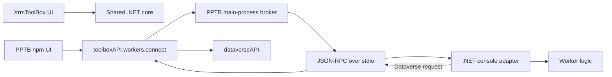
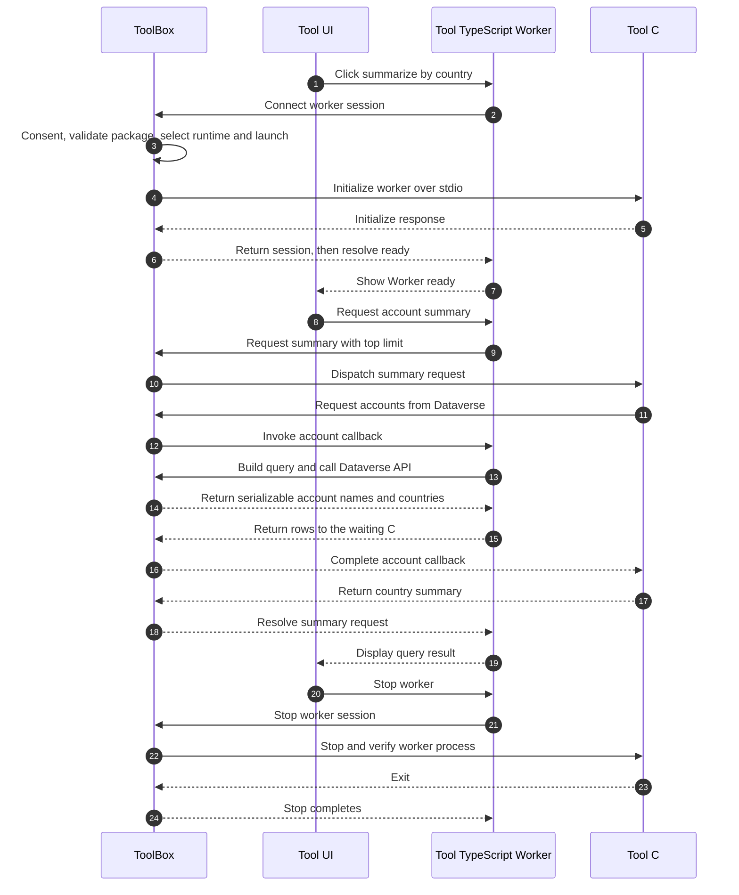

# .NET Workers In Power Platform ToolBox

This is the consolidated author/developer guide for reusing .NET business logic
from an XrmToolBox tool in a PPTB npm tool. The implementation is staged in the
[PR tracker](DOTNET_WORKERS_STATUS.md). The sample worker package has been
packed, installed from a local feed, and verified through PPTB's initialize
handshake on macOS/.NET 10. Cross-platform and packaged-app qualification remains
open; do not treat this single-host smoke as broad platform qualification.

## Architecture

Keep reusable business logic separate when you already share it with another
application. A separate Core DLL is optional; a small worker can contain its
query logic directly:



The existing XrmToolBox UI is not loaded into PPTB. Port/adapt the UI in
TypeScript. If business logic is already shared with XrmToolBox, put it in a
compatible .NET library and reference it from the console worker; otherwise the
worker can contain the logic itself. The worker maps external-service needs to
small RPC methods. For Dataverse, it asks the PPTB UI to execute FetchXML,
metadata or another explicit operation; the UI calls `dataverseAPI` and returns
serializable values. Do not send bearer tokens or connection credentials to the
worker.

The worker must keep dispatching incoming messages while a query awaits a
reverse callback. Otherwise request/response deadlocks. The transport is
bidirectional JSON-RPC, not a shell session and not a full LSP implementation.

Tool authors use `toolboxAPI.workers.connect(workerId, options)` to start the
worker declared under that ID in `pptb.config.json` and establish its session.
The session is returned before startup finishes; `session.ready` resolves after
PPTB completes the worker initialize handshake. PPTB owns process launch,
consent, JSON-RPC framing, readiness buffering, cancellation and cleanup.

`options.requests` maps method names to TypeScript callbacks that the C# worker
may invoke. In the sample, `worker.request("accounts/summarizeByCountry", {
top: 10 })` asks C# to summarize a bounded set of accounts by country.



### Code Map

| Hop                                                                         | Implementation                                                                      |
| --------------------------------------------------------------------------- | ----------------------------------------------------------------------------------- |
| Sample buttons and UI state                                                 | `sample-tools/new/html-sample/src/features/dotnetWorker.ts`                         |
| Public session types                                                        | `packages/types/toolboxAPI.d.ts` and `src/common/types/workerToolApi.ts`            |
| `connect`, request correlation, callback dispatch and cancellation          | `src/common/types/workerToolApiClient.ts`                                           |
| JSON-RPC framing adapter owned by PPTB                                      | `src/common/types/workerRpcConnection.ts`                                           |
| Tool preload to IPC bridge                                                  | `src/main/toolPreloadBridge.ts`                                                     |
| `worker:start/send/stop` IPC handlers and per-sender events                 | `src/main/utilities/workerToolIpc.ts`                                               |
| Sender identity, consent lease, runtime discovery and package preparation   | `src/main/managers/workerBrokerManager.ts`                                          |
| .NET SDK/runtime probing                                                    | `src/main/managers/dotnetDiscoveryManager.ts`                                       |
| NuGet restore, nuspec/artifact verification and cache                       | `src/main/managers/dotnetToolManager.ts`                                            |
| Child process, stdio framing, initialize handshake and cleanup verification | `src/main/managers/workerProcessManager.ts` and `src/main/utilities/workerStdio.ts` |
| `dataverseAPI.fetchXmlQuery` preload wrapper                                | `src/main/toolPreloadBridge.ts` (`DATAVERSE_CHANNELS.FETCH_XML_QUERY`)              |
| Main-process Dataverse FetchXML IPC handler                                 | `src/main/index.ts` (`DATAVERSE_CHANNELS.FETCH_XML_QUERY`)                          |
| C# stdio host and named query/callback methods                              | `sample-tools/new/html-sample/dotnet/Worker/Program.cs` and `WorkerMethods.cs`      |

At author level the normal path is just `connect`, `ready`, `request`, and
`stop`. The remaining rows describe platform-owned plumbing, not code each tool
developer needs to reproduce.

The HTML sample keeps the business operation in one Worker project, with no
separate Core project. Its reverse callback builds the FetchXML in TypeScript;
the worker receives account rows and performs the country aggregation in C#:

```csharp
using Newtonsoft.Json;
using StreamJsonRpc;

using var handler = new HeaderDelimitedMessageHandler(Console.OpenStandardOutput(), Console.OpenStandardInput());
using var rpc = new JsonRpc(handler);
rpc.AddLocalRpcTarget(new WorkerMethods(rpc));
rpc.StartListening();
await rpc.Completion;

public sealed class WorkerMethods(JsonRpc rpc)
{
    [JsonRpcMethod("platform/initialize")]
    public object Initialize(string protocol, int protocolVersion)
    {
        if (protocol != "jsonrpc-stdio-v1" || protocolVersion != 1)
            throw new InvalidOperationException("Unsupported PPTB worker protocol");
        return new { protocol, protocolVersion };
    }

    [JsonRpcMethod("accounts/summarizeByCountry")]
    public async Task<object> SummarizeAccountsByCountryAsync(int top, CancellationToken cancellationToken)
    {
        if (top is < 1 or > 100)
            throw new ArgumentOutOfRangeException(nameof(top));

        var result = await rpc.InvokeWithParameterObjectAsync<AccountReply>(
            "dataverse/getAccounts", new { top }, cancellationToken);
        var countries = result.Value
            .GroupBy(account => !string.IsNullOrWhiteSpace(account.Address1Country)
                    ? account.Address1Country.Trim()
                    : "Unspecified", StringComparer.OrdinalIgnoreCase)
            .OrderByDescending(group => group.Count())
            .ThenBy(group => group.Key, StringComparer.OrdinalIgnoreCase)
            .Select(group => new { country = group.Key, count = group.Count() });
        return new { totalAccounts = result.Value.Length, countries };
    }
}

public sealed record AccountReply([property: JsonProperty("value")] AccountRow[] Value);
public sealed record AccountRow(
    [property: JsonProperty("name")] string? Name,
    [property: JsonProperty("address1_country")] string? Address1Country);
```

The worker must continue reading stdio while `QueryAsync` awaits the reverse
request; `JsonRpc` does that here. The initialize method must return the
`jsonrpc-stdio-v1` protocol and version `1`, as shown by the sample worker.

`worker.cancel()` requests cancellation for outstanding calls. If `worker.stop()`
rejects, keep the session available and let the user retry cleanup; do not mark
the worker stopped or allow a new one to start prematurely. The lower-level
`start/send/onMessage` methods remain available for advanced transports, but
ordinary tools should prefer `connect()`.

## Sharing The Core DLL

Two common package shapes work:

1. **Two NuGet packages:** publish the reusable core library and the console
   adapter separately. The XrmToolBox plugin and console adapter reference the
   same versioned core package. Prefer this when the core already has a NuGet
   release lifecycle.
2. **One worker NuGet package:** keep the core project in the same repository or
   use a stable binary project reference; the console adapter references it and
   includes the required core assembly/dependencies in the packed .NET tool. The
   XrmToolBox project can reference the same source/project where practical.

PPTB installs the **console worker tool**, not an arbitrary DLL. Authors must
inspect the resulting `.nupkg` to verify that the worker entry point, core DLL
and runtime dependencies are included. A project reference alone is not proof
that the desired files are in the package.

When the core library is already published on nuget.org, the local worker package
can depend on that exact core version; local source mapping routes the worker
package ID to the developer feed and dependencies to nuget.org. If the core
changes are unpublished too, use a project reference/bundled core DLL for local
iteration. PR7's developer feed intentionally maps only the declared worker ID,
so it does not serve a second unpublished core NuGet package.

The shared core should avoid XrmToolBox UI types. A .NET Framework-only or
Windows-only dependency may require multi-targeting/refactoring before it can be
referenced by a modern .NET console worker. A compatible TFM does not prove
compatibility with every OS, architecture or native dependency.

## Declare A Worker

Declare a worker in the local npm package's `pptb.config.json`; this metadata is
not a command, path or permission grant:

```json
{
    "workers": {
        "engine": {
            "kind": "dotnet-tool",
            "packageId": "Contoso.SqlWorker",
            "packageVersion": "1.4.2",
            "command": "contoso-sql-worker",
            "dotnet": {
                "targetFramework": "net8.0",
                "minimumRuntimeVersion": "8.0.0",
                "rollForward": "Major"
            },
            "platforms": ["all"]
        }
    }
}
```

The fields mean:

- `packageId`, `packageVersion`: exact NuGet .NET tool identity/version; no tags,
  floating versions or ranges.
- `command`: tool command declared by the NuGet tool package, not an executable
  path or arbitrary argument list.
- `dotnet.targetFramework`: worker executable TFM; the shared core can target a
  different compatible TFM.
- `minimumRuntimeVersion`: stable `major.minor.patch` matching the TFM's
  major/minor and not lower than the binary requirement.
- `rollForward`: `Disable`, `Latest`, `Minor`, or `Major`; if omitted it defaults
  to `Major`. `Latest` maps internally to .NET `LatestMajor`.
- `platforms`: required aliases `all`, `windows-x64`, `windows-arm64`,
  `macos-x64`, `macos-arm64`, `linux-x64`, `linux-arm64`. `all` must be alone.
  It means the versioned PPTB support matrix, not every possible .NET target.

See [declaration and runtime policy details](DOTNET_WORKERS_ENGINEERING.md#declaration-and-discovery-pr1-pr2) for
validation limits and precise roll-forward semantics.

## Runtime Selection

PPTB currently requires a compatible installed .NET 10.0 SDK (10.0.100 or later)
for local tool preparation. The worker runtime is selected independently from
that SDK:

| PPTB `rollForward` | Behavior                                                                                              |
| ------------------ | ----------------------------------------------------------------------------------------------------- |
| `Disable`          | Exact minimum runtime version, including patch.                                                       |
| `Latest`           | Highest available compatible major, minor and patch.                                                  |
| `Minor`            | Prefer requested line/latest patch; otherwise next minor in the same major.                           |
| `Major` (default)  | Prefer requested line/latest patch, then the next minor in that major, then a higher major if needed. |

No runtime below the declared minimum is selected. PPTB does not silently install
a missing SDK or runtime. A later major is not automatically safe merely because
the host can load the framework; authors must test the compatibility they declare.
The exact supported console TFMs and runtime-config checks are in the declaration
guide.

## Public Tool API

For typical tools, use `toolboxAPI.workers.connect()` as shown above. PPTB owns
the JSON-RPC connection and exposes named `request`, `notify`, `cancel`, and
`stop` methods. Advanced authors can use `start/send/onMessage/onExit/stop`
directly when they need a different protocol adapter. Both surfaces take only a
declared worker ID and opaque handle; they do not accept executable paths, shell
arguments, feeds, environment variables, working directories, tool IDs or
instance IDs. PPTB derives authority from the actual tool `WebContents`, and
events are sent only to their owning tool.

Start is explicit: loading the npm tool does not restore a package or launch a
worker. Startup performs live identity/source validation, native-code consent,
SDK/runtime discovery, exact package preparation and the protocol handshake.

## Protocol And Reverse Calls

The worker uses framed UTF-8 JSON-RPC over stdin/stdout (`jsonrpc-stdio-v1`).
stdout is protocol-only; stderr is separately bounded and redacted. The worker
must respond to `platform/initialize` with protocol version 1 before domain
traffic. Progress is sent as notifications. Cancellation uses JSON-RPC
cancellation, but an engine must cooperate for active computation to stop.

Example reverse-call flow:

1. TypeScript starts a query request in the worker.
2. The .NET worker invokes a narrow declared method such as
   `dataverse/getAccounts({ top })`.
3. TypeScript builds the FetchXML, calls `dataverseAPI.fetchXmlQuery`, and returns
   only serializable account fields.
4. The original .NET operation resumes and returns its result.

Define domain methods narrowly. Do not serialize arbitrary SDK graphs or silently
replace unsupported operations with empty results. Map metadata, paging, SDK
value types and service errors deliberately for the actual engine.

See the [internal transport contract](DOTNET_WORKERS_ENGINEERING.md#process-transport-pr4)
and [broker lifecycle/security contract](DOTNET_WORKERS_ENGINEERING.md#consent-and-broker-pr5-pr6).

## Local Debug With An Unpublished Package

For active sample-tool development, an unpublished worker `.nupkg` can be tested
without publishing each change to NuGet, but only when both the Vite developer
build marker and unpackaged-app check pass. The absolute feed path must be
provided to the main process as `PPTB_DOTNET_LOCAL_NUGET_FEED`; it is not a
manifest or renderer setting and is never exposed through the tool preload.

Build the co-located HTML sample and pack its declared worker package into a
flat local feed:

```sh
npm --prefix ../sample-tools/new/html-sample install
npm --prefix ../sample-tools/new/html-sample test
npm --prefix ../sample-tools/new/html-sample run pack:worker
```

The C# projects, HTML tool, worker declaration and adapter tests are maintained
together in `sample-tools/new/html-sample`. The pack command writes the exact
declared package to `dotnet/feed/`; inspect the `.nupkg` to confirm it contains
the worker entry point, shared core DLL and managed dependencies. A project
reference alone does not prove the payload is complete.

Launch `pnpm run dev` with `PPTB_DOTNET_LOCAL_NUGET_FEED` set in the **main
process environment** to the absolute `../sample-tools/new/html-sample/dotnet/feed`
path. The Vite development bundle
injects the separate main-only `PPTB_DEVELOPER_BUILD=1` marker. Production-mode
unpackaged builds and packaged builds reject local feeds. With **Load Local
Tool**, explicitly start the declared worker, review native-code consent, wait
for package verification and the initialize handshake, then exercise a query
and reverse callback, progress, cancellation and stop/close behavior.

The feed path is not in `pptb.config.json`, is not sent by a renderer, and is
never exposed through the tool preload. The configured local feed supplies only
the exact declared worker package ID/version; NuGet source mapping keeps its
other dependencies on nuget.org. Missing local packages fail rather than falling
back to nuget.org. Registry, marketplace and npm-debug tools remain nuget.org-only.
The consent fingerprint includes source path and package SHA-512, so changing
either requires fresh approval and preparation.

Automated checks from the repository root:

```sh
npm --prefix ../sample-tools/new/html-sample test
pnpm run test:unit --runInBand --runTestsByPath tests/unit/main/workerToolApi.test.ts tests/unit/main/utilities/dotnetLocalFeed.test.ts tests/unit/main/managers/nativeWorkerIdentity.test.ts tests/unit/main/managers/dotnetToolManager.test.ts
pnpm exec playwright test tests/e2e/nativeWorkerConsent.test.ts
```

The sample repo's bridge tests use simulated transport and do not prove C# interoperability.
The real-package smoke requires an installed .NET 10 SDK and the configured
local feed. Verify consent denial performs no restore/launch; missing SDK,
runtime, package, command or protocol leaves no usable partial cache; exact-feed
restore and warm reuse work; changed source/package bytes invalidate consent and
cache; reverse calls work while the original request is pending; and no token or
credential environment reaches the worker. Confirm npm-debug, registry and
marketplace tools remain nuget.org-only and normal npm install performs no .NET
discovery, restore or worker launch.

The current sample is a protocol/core-sharing demonstration, not an SQL 4 CDS
integration. PR0 exercised SQL 4 CDS 10.5.1 with a simulated narrow
organization-locale callback on macOS arm64/.NET 8; that does not verify a live
SQL 4 CDS query. The sample's .NET 10 package has since been packed, installed
from the local feed and verified with the PPTB initialize handshake on macOS.
Full Windows/macOS/Linux RID and packaged-app qualification remains PR8.

See the [internal local-feed and qualification notes](DOTNET_WORKERS_ENGINEERING.md#pr7-local-feed-and-qualification)
and [PR7 execution plan](../.github/plans/plan-dotnet-workers-pr7.md).
The C# worker and UI setup now live together in the sibling
`sample-tools/new/html-sample` repository.

## Security And Lifecycle

A .NET worker is trusted native code running as the current user. It is **not**
an OS sandbox: it can access same-user files, use the network and start child
processes. Stdio and consent are not containment. Consent is bound to the exact
tool version, worker declaration, package source/content, protocol and platform
matrix. Revocation cancels matching work; tool close, crash, updates and app quit
must await verified cleanup. An unverified child/restore stop blocks destructive
mutation instead of claiming it succeeded.

No bearer tokens are passed to the worker. Do not add workers to terminal
execution, MCP/headless invocation or implicit app startup. The existing
`dotnet` terminal block remains in effect.

## Status And References

- [PR status and evidence for every slice](DOTNET_WORKERS_STATUS.md)
- [Internal engineering constraints and PR0 evidence](DOTNET_WORKERS_ENGINEERING.md)
- [PR7 tool API and sample adaptation plan](../.github/plans/plan-dotnet-workers-pr7.md)
